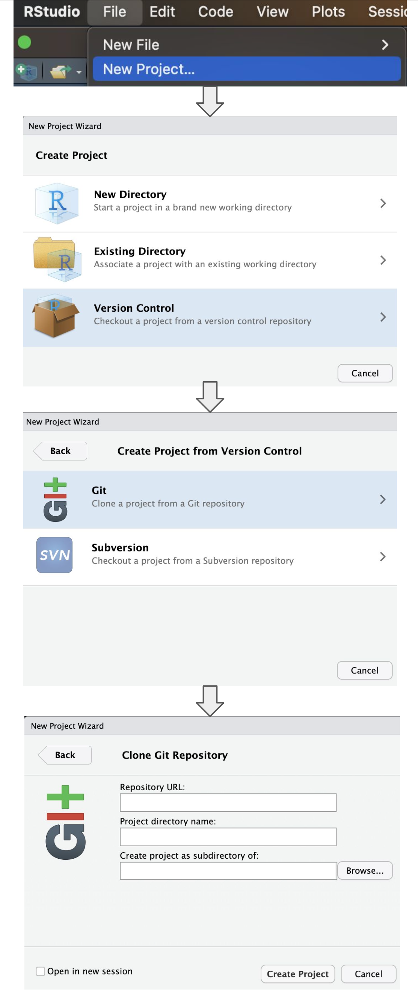

## Background

...

## Objective

...

## Publications

-   See the arXiv pre-print [here](https://arxiv.org/abs/2405.10925)

## Dependencies

...

## Reproducibility

Follow these steps in RStudio to reproduce this study:

1.  Clone this repository via `git clone <url>` or in RStudio via **File
    &gt; New Project &gt; Version Control &gt; Git &gt; then paste the
    link to repository URL**
2.  Install all necessary dependencies via `Rscript _dependencies.R` in
    Terminal (see above)
3.  Add/adapt the paths to the datasets in `.Renviron`
4.  In RStudio, run all scripts via `quarto render` or
    `Build > Render Book` (make sure quarto is installed)

<figure>

<figcaption aria-hidden="true">Steps to clone this repository in
RStudio</figcaption>
</figure>

## IRB information

This referenced project does not meet the criteria for human subject
research as defined by Mass General Brigham Human Research Office
policies, Health and Human Services (HHS) regulations set forth in 45
CFR 46, and Food and Drug Administration (FDA) regulations set forth in
21 CFR 56. The project involves public health surveillance activity as
defined by HHS regulations at 45 CFR 46.102(l)(2).

The project does not require IRB approval.
